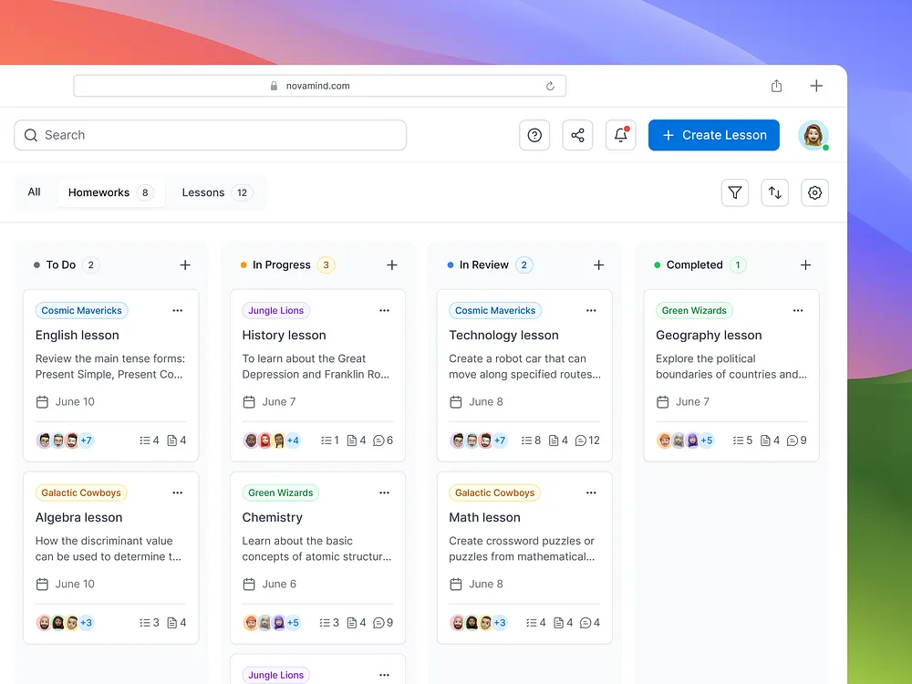

<div align="center">

# ⬡ Vertex

**A full-stack project management workspace built for engineering teams.**  
Kanban boards, team collaboration, real-time activity, and file management —  
secured from the ground up and deployable in minutes.

[](https://nextjs.org)
[](https://typescriptlang.org)
[](https://supabase.com)
[](https://tailwindcss.com)
[](LICENSE)



</div>

---

## What is Vertex?

Vertex is a **production-grade project management application** built entirely on the Next.js App Router. It gives engineering teams a single workspace to plan, track, and ship work — without the overhead of bloated tools.

Every layer of the stack was designed with two things in mind: **developer experience** and **security by default**. There are no client-exposed secrets, no unguarded mutations, and no unauthenticated reads on team data.

---

## Features

### Kanban Boards
- Drag-and-drop task management powered by **dnd-kit** with optimistic UI updates
- Five configurable stages: `Backlog → Todo → In Progress → Review → Completed`
- Custom per-project workflow stages — each project can define its own pipeline
- Filter tasks by **priority**, **assignee**, **label**, and **due date** simultaneously
- Self-referencing **task dependency graph** with cycle detection (a task cannot block itself)

### Task Management
- Rich task detail modal: description, labels, due date, assignee, comments, attachments
- Four priority levels: `Low · Medium · High · Critical` with visual indicators
- Auto-generated sequential task IDs (`VTX-101`, `VTX-102`, …) scoped per project
- Comment threads per task with author attribution and real-time count sync
- File attachments up to **20 MB** with server-side type validation and magic byte checks

### Team Workspaces
- Create unlimited workspaces, each with its own projects and members
- **Shareable invite links** — anyone with the link can join (no invite email required)
- Workspace team chat with persistent message history
- Member list with avatar, name, and role

### Authentication
- **Email + password** sign-up and sign-in
- **Google OAuth** and **GitHub OAuth** via PKCE flow
- Forgot-password and password-reset via Supabase email
- HMAC-SHA256 signed session cookies — tamper-evident, no database round-trip on verify

### Activity & Notifications
- Per-project **activity feed** logging every task event (create, move, assign, comment, delete)
- **In-app notification bell** with unread badge — notifies assignees and task creators on comments and assignments
- Fire-and-forget logging keeps the hot path (drag-and-drop) non-blocking

### Security
- **Zero IDOR vulnerabilities** — every mutation and read verifies session + team membership before touching the database
- **Edge middleware** route guard — unauthenticated requests never reach RSC or server action code
- **Rate limiting** on all auth endpoints (5 req/min per IP) with Redis → PostgreSQL → in-memory fallback
- Full security header suite: CSP, HSTS, X-Frame-Options, X-Content-Type-Options, Referrer-Policy
- Upload route validates file extensions, magic bytes, and scans text files for injected HTML/script

---

## Tech Stack

| Layer | Technology | Purpose |
|---|---|---|
| **Framework** | Next.js 16.2 (App Router) | Full-stack React with server components, server actions, and edge middleware |
| **Language** | TypeScript 5 | End-to-end type safety across server and client |
| **Database** | PostgreSQL via Supabase | Managed Postgres with connection pooling (pgBouncer) |
| **ORM** | Prisma 7 (`@prisma/adapter-pg`) | Type-safe database client with generated types |
| **Auth** | Supabase Auth + custom session | Email/password and OAuth with HMAC-SHA256 signed cookies |
| **Styling** | Tailwind CSS v4 | Utility-first styling with tw-animate-css for transitions |
| **UI Components** | shadcn/ui + Radix UI | Accessible, unstyled primitives composed into custom components |
| **Drag and Drop** | dnd-kit | Accessible, performant kanban drag-and-drop |
| **Icons** | lucide-react | Consistent SVG icon set |
| **Date Handling** | date-fns v4 | Lightweight date formatting and arithmetic |
| **Rate Limiting** | ioredis + PostgreSQL | Distributed rate limiting with automatic fallback chain |
| **File Storage** | Supabase Storage | User-scoped object storage with service-key uploads |
| **Runtime** | Node.js (server actions) + Edge (middleware) | Dual-runtime: Edge for route guards, Node for DB access |

---

## Architecture

```
┌─────────────────────────────────────────────────────────────────┐
│                         Browser                                  │
│   React 19 Client Components  ←→  Server Components (RSC)       │
└───────────────────────┬─────────────────────────────────────────┘
                        │ HTTP
┌───────────────────────▼─────────────────────────────────────────┐
│                    Edge Middleware                                │
│   middleware.ts — HMAC cookie verify → allow / redirect          │
│   Runs on Edge runtime (no Node APIs, no DB, pure crypto)        │
└───────────────────────┬─────────────────────────────────────────┘
                        │
          ┌─────────────┴──────────────┐
          │                            │
┌─────────▼──────────┐    ┌────────────▼──────────────┐
│   Server Actions   │    │       API Routes           │
│  app/actions/*.ts  │    │   app/api/upload/route.ts  │
│                    │    │   app/api/auth/*.ts         │
│  Auth guard on     │    │                            │
│  every mutation    │    │  Upload: auth + magic byte  │
│  and sensitive     │    │  OAuth: PKCE code exchange  │
│  read              │    └────────────────────────────┘
└─────────┬──────────┘
          │
┌─────────▼──────────────────────────────────────────────────────┐
│                     Data Layer                                   │
│                                                                  │
│   Prisma Client (lib/generated/prisma)                           │
│     └── @prisma/adapter-pg → pg pool → Supabase pgBouncer       │
│                                                                  │
│   Supabase PostgreSQL   │   Supabase Auth   │  Supabase Storage  │
└─────────────────────────────────────────────────────────────────┘
```

### Key Architectural Decisions

**Server Actions over API routes** — All data mutations use Next.js Server Actions. This co-locates the auth guard, business logic, and database call in one file with no extra HTTP layer, and means mutations cannot be called cross-origin by default.

**Dual-runtime session verification** — `session.ts` uses only the Web Crypto API (`crypto.subtle`) so the same HMAC logic runs in both the Node.js runtime (server actions) and the Edge runtime (middleware) without any code duplication or `Buffer` polyfills.

**Defence-in-depth auth** — Middleware handles the first check at the edge (redirect unauthenticated users before RSC work begins). Server actions handle the second check (verify session + team membership before any DB write). Both layers must pass independently.

**Fire-and-forget activity logging** — `logActivity()` is always called with `void` and never `await`ed on hot paths. A drag-and-drop column update resolves the moment the Prisma write completes, not after the activity log write.

---

## Database Schema

```
Profile ──< Task (assignee)
         ──< Task (creator)
         ──< Comment
         ──< Attachment
         ──< Message
         ──< Notification
         >──< Team (members, many-to-many)

Team ──< Project
     ──< Message
     ──< TeamInvitation

Project ──< Task

Task ──< Comment
     ──< Attachment
     >──< Task (dependencies, self-referencing many-to-many)

ActivityLog (denormalized — no joins needed for activity feed reads)
```

**10 models**, 6 migrations, composite indexes on all hot query paths (`projectId`, `assigneeId`, `taskId`, `userId`, `createdAt`).

---

## Security Model

Vertex was built security-first. Here is what is enforced at each layer:

### Session

- Cookie format: `{userId}.{base64url(HMAC-SHA256(userId, SESSION_SECRET))}`
- Verification uses constant-time string comparison to prevent timing attacks
- `SESSION_SECRET` must be ≥ 32 random characters; the server throws hard in production if it is missing
- Cookies are `httpOnly`, `secure` (production), `sameSite: lax`

### Authorization

Every server action that reads or writes team data calls one of:

```
verifyProjectAccess(projectId)
  → getSessionUserId()                   [throws if no session]
  → prisma.team.findFirst({ members: { some: { id: userId } } })  [throws if not a member]

verifyTaskAccess(taskId)
  → resolves task.projectId
  → delegates to verifyProjectAccess()

verifyTeamAccess(teamId)
  → getSessionUserId()
  → prisma.team.findFirst({ members: { some: { id: userId } } })
```

### OAuth

- PKCE flow: SHA-256 `codeVerifier` stored in `httpOnly` cookie, `codeChallenge` sent to Supabase
- `codeVerifier` is consumed and deleted on callback — cannot be replayed
- Open-redirect guard on callback: destination validated as a relative path starting with `/` and not `//`

### Rate Limiting

Auth endpoints are limited to **5 requests per minute per IP**:

```
rateLimit(key, limit, windowMs)
  1. Redis (atomic INCR + TTL pipeline)    ← preferred
  2. PostgreSQL (atomic upsert RETURNING)  ← fallback if no Redis
  3. In-memory Map                         ← last resort
```

### File Uploads

Layered validation on every upload:
1. Auth check (401 if no session)
2. Size cap (413 if > 20 MB)
3. Extension allowlist (png, jpg, gif, webp, pdf, txt, csv, zip, doc/docx, xls/xlsx)
4. Magic byte validation per format (PNG: `89504E47`, JPEG: `FFD8FF`, PDF: `25504446`, etc.)
5. HTML/script injection scan on text files (first 1 KB)

### HTTP Security Headers
```
X-Frame-Options:           DENY
X-Content-Type-Options:    nosniff
Strict-Transport-Security: max-age=31536000; includeSubDomains; preload
Referrer-Policy:           strict-origin-when-cross-origin
Content-Security-Policy:   default-src 'self'; connect-src 'self' *.supabase.co; ...
```

---

## Project Structure

```
vertex/
├── app/
│   ├── (auth)/                   # Auth route group (unauthenticated)
│   │   ├── signIn/
│   │   ├── signUp/
│   │   ├── forgot-password/
│   │   └── reset-password/
│   ├── (home)/                   # Protected route group (requires session)
│   │   ├── home/
│   │   │   └── projects/[projectId]/   # Kanban board page
│   │   ├── teams/
│   │   │   └── [teamId]/collab/        # Team chat page
│   │   ├── invite/[teamId]/            # Public invite landing
│   │   └── settings/
│   ├── actions/                  # Server Actions
│   │   ├── tasks.ts              # Task + project CRUD
│   │   ├── chat.ts               # Team + message actions
│   │   ├── auth.ts               # Sign-up / sign-in / logout
│   │   ├── reset-password.ts     # Password update (server-side)
│   │   ├── activity.ts           # Activity log writer
│   │   ├── notifications.ts      # Notification CRUD
│   │   └── profile.ts            # Profile read/update
│   └── api/
│       ├── auth/
│       │   ├── callback/route.ts # OAuth code exchange
│       │   └── google/route.ts   # Google OAuth initiation
│       └── upload/route.ts       # Hardened file upload
│
├── components/
│   ├── kanban/                   # Modular kanban components
│   │   ├── KanbanColumn.tsx
│   │   ├── TaskCard.tsx
│   │   ├── TaskDetailModal.tsx
│   │   ├── TaskCreateModal.tsx
│   │   ├── ProjectCreateModal.tsx
│   │   └── FilterBar.tsx
│   ├── auth/                     # Auth form components
│   ├── ui/                       # shadcn/ui primitives
│   └── iconComp/                 # Brand SVG icons (Google, GitHub, Discord)
│
├── lib/
│   ├── auth/
│   │   ├── session.ts            # HMAC cookie — Edge + Node compatible
│   │   ├── rate-limit.ts         # Redis → PostgreSQL → memory fallback
│   │   ├── sign-in.ts
│   │   ├── sign-up.ts
│   │   ├── oauth.ts              # PKCE helpers
│   │   └── forgot-password.ts
│   ├── generated/prisma/         # Auto-generated Prisma client
│   ├── contexts/                 # React contexts (Sidebar, AuthPrompt)
│   ├── types/kanban.ts           # Shared TypeScript types
│   ├── prisma.ts                 # Prisma client singleton
│   └── projects.ts               # Workflow stage definitions
│
├── prisma/
│   ├── schema.prisma             # 10-model PostgreSQL schema
│   └── migrations/               # 6 sequential migrations
│
├── middleware.ts                 # Edge route guard (HMAC verify)
├── next.config.ts                # Security headers + image domains
└── script/                       # Integration test scripts
```

---

## Getting Started

### Prerequisites

- **Node.js** 18.17 or later
- **A Supabase project** — [create one free](https://supabase.com)
- **Redis** (optional) — falls back to PostgreSQL rate limiting if not configured

### 1. Clone and install

```bash
git clone https://github.com/your-username/vertex.git
cd vertex
npm install
```

### 2. Configure environment

```bash
cp .env.example .env
```

Open `.env` and fill in every value. See the [Environment Variables](#environment-variables) section below.

### 3. Set up the database

```bash
# Apply all migrations to your Supabase Postgres instance
npx prisma migrate deploy

# Regenerate the Prisma client (run after any schema change)
npx prisma generate
```

### 4. Configure Supabase Auth

In your Supabase dashboard:

1. **Authentication → Providers** — enable Google and/or GitHub and paste in your OAuth app credentials
2. **Authentication → URL Configuration**:
   - Site URL: `http://localhost:3000` (development) or your production domain
   - Redirect URLs: add `http://localhost:3000/api/auth/callback`
3. **Storage → Buckets** — create a bucket named `task-attachments` (set to private)

### 5. Run the development server

```bash
npm run dev
```

Open [http://localhost:3000](http://localhost:3000).

---

## Environment Variables

| Variable | Required | Description |
|---|---|---|
| `DATABASE_URL` | ✅ | Supabase PostgreSQL connection string (transaction mode pooler) |
| `DIRECT_URL` | ✅ | Direct connection string for migrations (session mode pooler) |
| `SUPABASE_URL` | ✅ | Your Supabase project URL (`https://<ref>.supabase.co`) |
| `SUPABASE_ANON_KEY` | ✅ | Supabase anon/public key — used for Auth API calls server-side |
| `SUPABASE_SERVICE_KEY` | ✅ | Supabase service role key — used for Storage uploads and admin user lookups |
| `SESSION_SECRET` | ✅ | ≥ 32 random characters for HMAC session signing. Generate: `openssl rand -hex 32` |
| `NEXT_PUBLIC_APP_URL` | ✅ | Full URL of your app (`http://localhost:3000` or `https://yourdomain.com`) |
| `REDIS_URL` | ⬜ | Redis connection string for distributed rate limiting. Omit to use PostgreSQL fallback. |

> **Security note:** Never commit `.env` to version control. The `.gitignore` excludes all `.env*` files. Rotate `SESSION_SECRET` and `SUPABASE_SERVICE_KEY` if they are ever exposed.

---

## Deployment

Vertex is optimised for **Vercel** but works on any platform that supports Next.js and Node.js.

### Vercel (recommended)

```bash
npm i -g vercel
vercel --prod
```

Set all environment variables in **Vercel → Project → Settings → Environment Variables**. Update your `NEXT_PUBLIC_APP_URL` to your production domain, and add your production URL to Supabase's allowed redirect list.

### Self-hosted

```bash
npm run build
npm start
```

Ensure the server has outbound access to your Supabase project URL and (optionally) your Redis instance.

### Pre-deployment checklist

- [ ] All environment variables set in production environment
- [ ] `NEXT_PUBLIC_APP_URL` updated to production domain
- [ ] Supabase redirect URL includes production callback (`/api/auth/callback`)
- [ ] `task-attachments` storage bucket created in Supabase
- [ ] `SESSION_SECRET` is at least 32 characters and unique to production
- [ ] `SUPABASE_SERVICE_KEY` is the production project's service key
- [ ] Redis instance configured (or confirm PostgreSQL fallback is acceptable)

---

## Development Scripts

```bash
npm run dev          # Start development server on http://localhost:3000
npm run build        # Production build
npm run start        # Start production server
npm run lint         # Run ESLint

# Database
npx prisma generate          # Regenerate Prisma client after schema changes
npx prisma migrate dev       # Create and apply a new migration
npx prisma migrate deploy    # Apply pending migrations (production)
npx prisma studio            # Open Prisma Studio (visual DB browser)

# Integration tests (require TEST_USER_ID in .env)
npx tsx script/test-signup.ts
npx tsx script/test-signin.ts
npx tsx script/test-tasks.ts
npx tsx script/test-dependencies.ts
```

---

## Contributing

1. Fork the repository and create a branch: `git checkout -b feat/your-feature`
2. Make your changes, following the existing server action guard pattern for any new mutations
3. Run `npm run lint` and fix any issues
4. Open a pull request with a clear description of what changed and why

When adding new server actions that touch team data, always call `verifyProjectAccess`, `verifyTaskAccess`, or `verifyTeamAccess` as the first line. No exceptions.

---

## License

MIT — see [LICENSE](LICENSE) for details.

---

<div align="center">

Built with Next.js · Prisma · Supabase · Tailwind CSS · shadcn/ui

</div>
